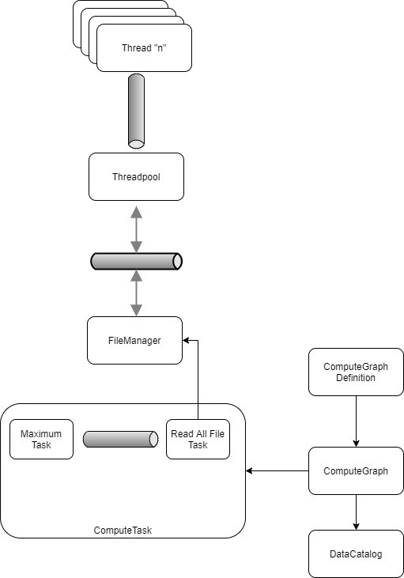

# Columnar DB

## Architecture

The following example will build a DAG that will read a u8 packed file (a column in a columnar DB) and will calculate its maximum value.

```rust
let mut pool = Threadpool::new(); // 1
pool.create_one_per_cpu().expect("Cannot create Threadpool");

let filemgr = FileManager::new(&mut pool); // 2

let mut catalog = DataCatalog::new(); // 3
catalog.add("Table1.Column1", "Table1.Column1.dat");

let mut def = ComputeGraphDefinition::new(); // 4
let t1c1 = def.from_columns("Table1.Column1");
let _maxt1c1 = def.fold_source(&t1c1, ComputeTaskDefinitionFolds::Maximum);

let mut computation = def.build(&catalog); // 5

computation.start(); // 6
```

1 -   
First step we need the Threadpool. We deciced for one thread per CPU.

2 -  
FileManager is the struct that do every IO. You specify the Sender<> that needs the result.

3 -  
DataCatalog translates columns full names to files.

4 -  
ComputeGraphDefinition specify all the desired computation as DAG. This class is serializable.

5 -  
We use this class to build the actual DAG that will compute our query.

6 -  
We actually run our DAG using our Threadpool.

## Diagram



Behind the scenes each "Task" comunicate thrgough channels. It is the ComputeGraphDefinition::build task to create the DAG and connect all channels so they work.

All real computation is sent to the Theadpool. Also by channels.

## References
### Internet
https://www.infoq.com/articles/columnar-databases-and-vectorization  