# Writing Complex Unreal functions in C++

A lot of languages have embarked on the coroutine model using async/await. Unreal is not different. But here, they are called Latent Functions. There is no easy way to write Latent Functions using Blueprint, so we must jump to C++.

Their complexity is justified because they allow you to have very elegant Blueprints, allowing non-developers to orchestrate complex behaviour and tune the game the way they see fit.

To arrive at our desired aim, we will need four steps.

- Simple Function in C++
- Function with multiple Exec pins
- Simple Latent Function
- Latent Function with Multiple Exec pins

# Creating our project

We don't need much here. So we are going to create a simple blank project. Create a useless cube actor.

All our reactions to our new Blueprint nodes will just print strings.

So head up to "New Project" and create a new Blank project.


The vital step here is to change from "Blueprint" project to "C++" project. Which actually allow us to use both.

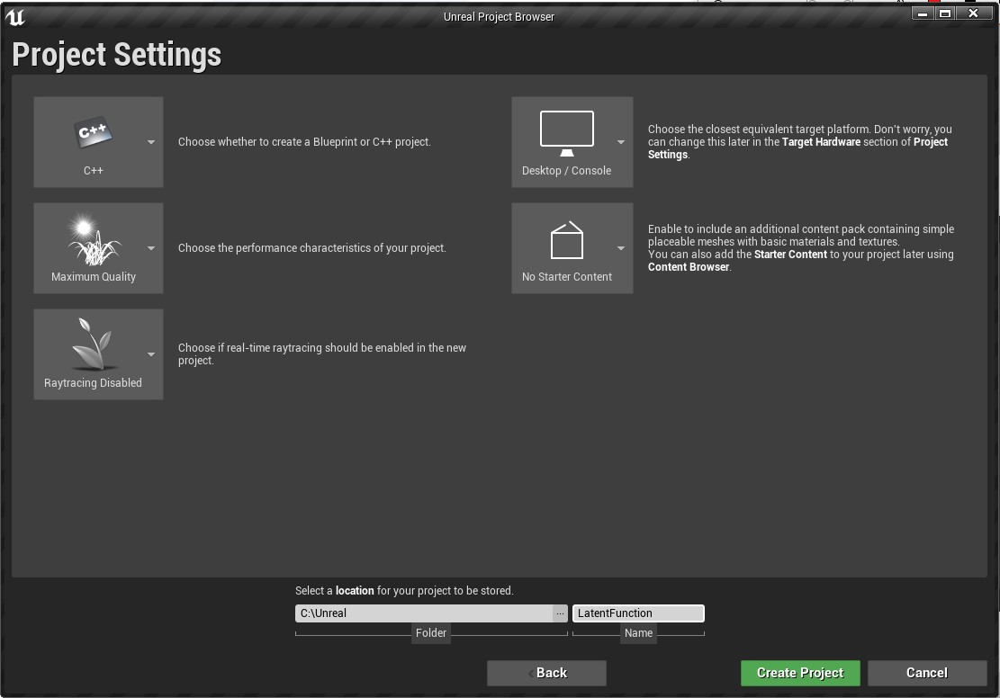

I have previously selected VSCode as the editor. If you haven't, Visual Studio will pop up instead.

There is no difference. Just choose whatever best suits you.

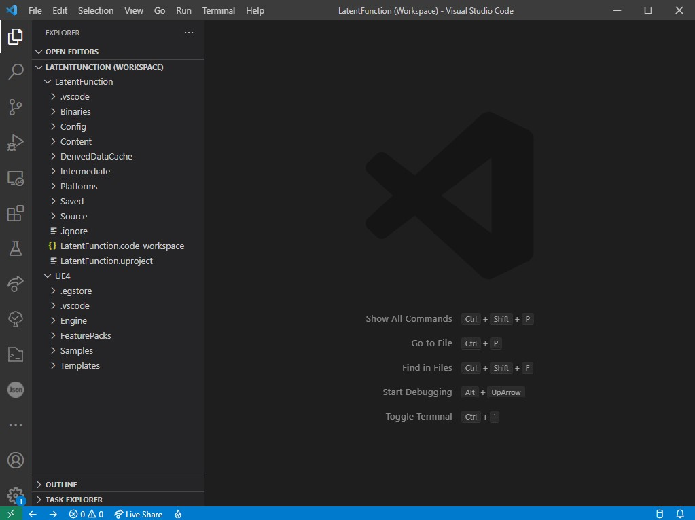

If you go back to Unreal and hit "Compile", you will hear two noises. One signal compilation start, and the other compilation ended.

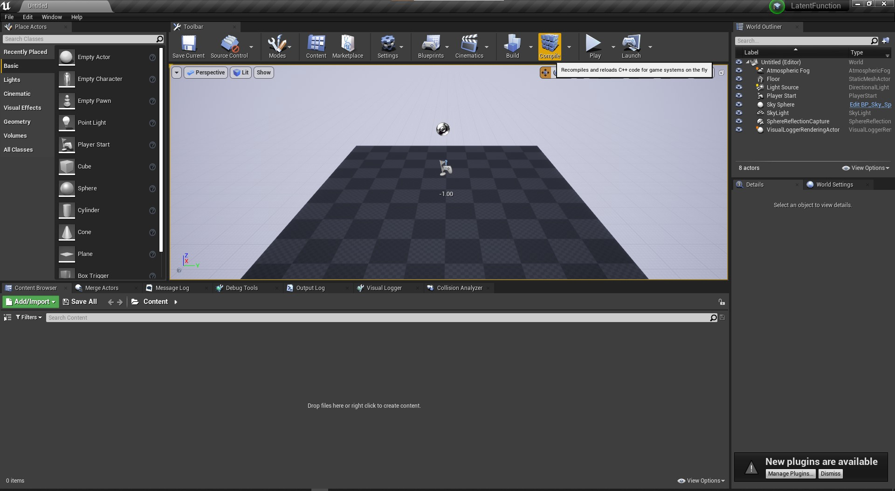

The compilation result will appear at "Message Log -> Compiler Log". You can double click on errors here, and it will open VSCode/Visual Studio on that particular file and line. That's nice!


Before we jump into code, let us create out actor.

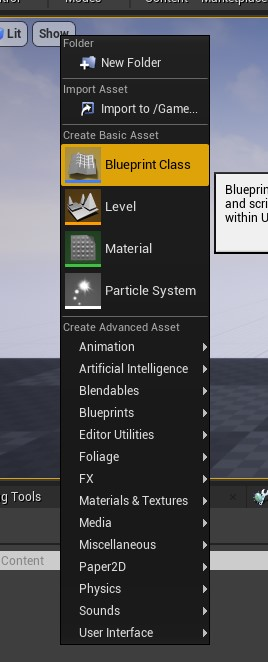

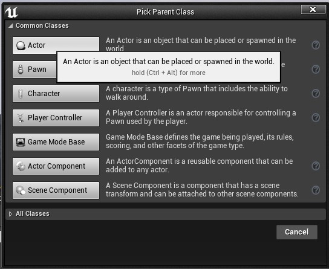

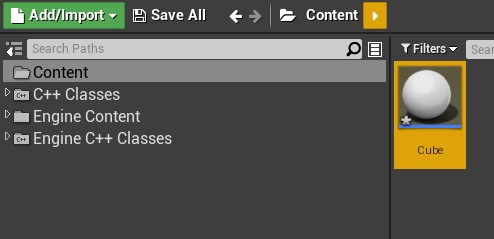

Any actor will do, so let us just create a simple and useless Cube actor.

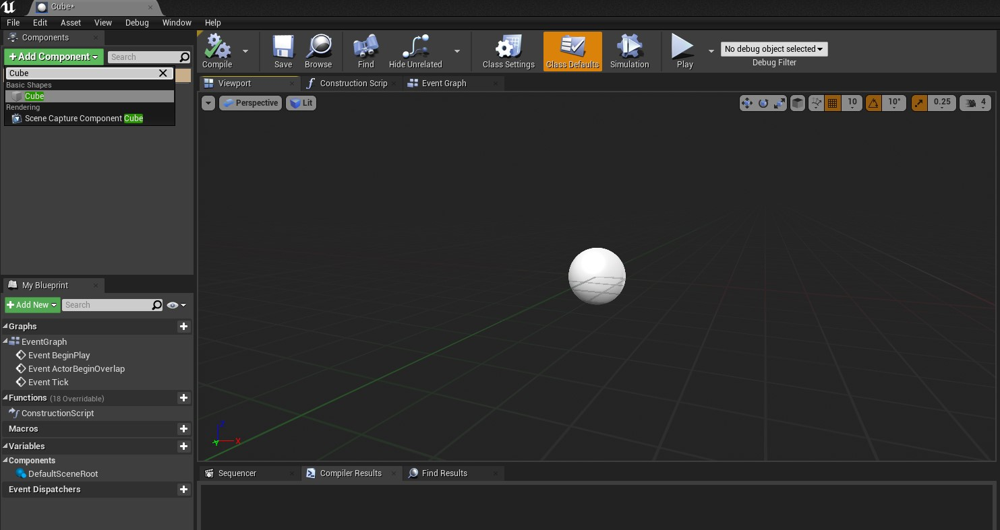

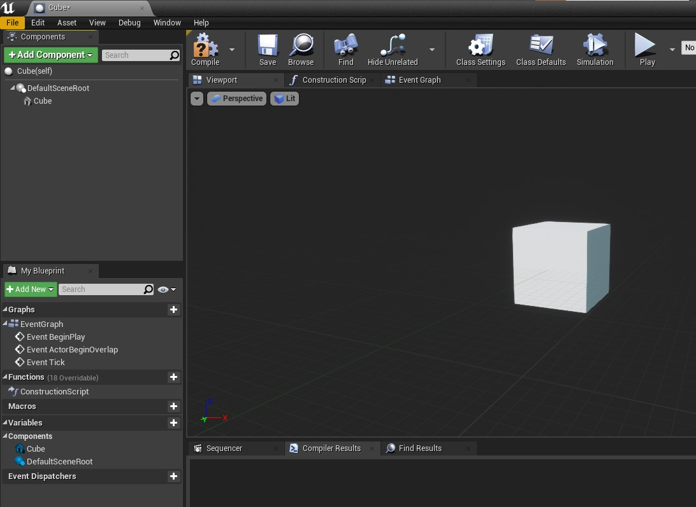

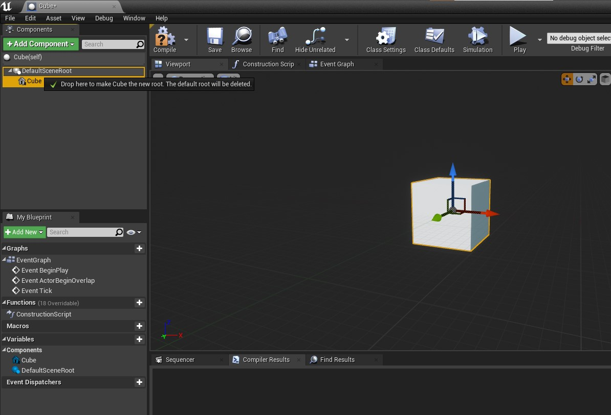

The important part is that we will be reacting to our new Blueprint nodes here. For now, let us just print something.

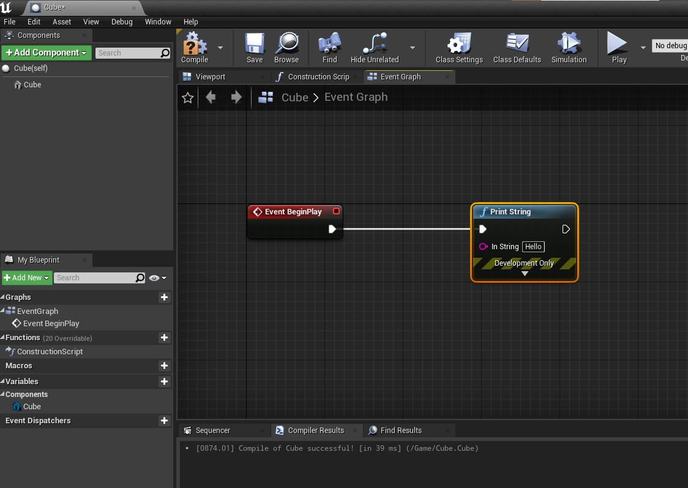

And let us not forget to place the actor in the world.


Hit "Play" and verify everything is working.


We are ready to start.

# Create a function in C++

Our first example is going to be a simple Blueprint node. Nothing fancy. You pass a parameter, and the function print the string you passed.

We will create all our nodes inside a "Blueprint Function Library".

The code is as simple as that.


Implementation is also straightforward.

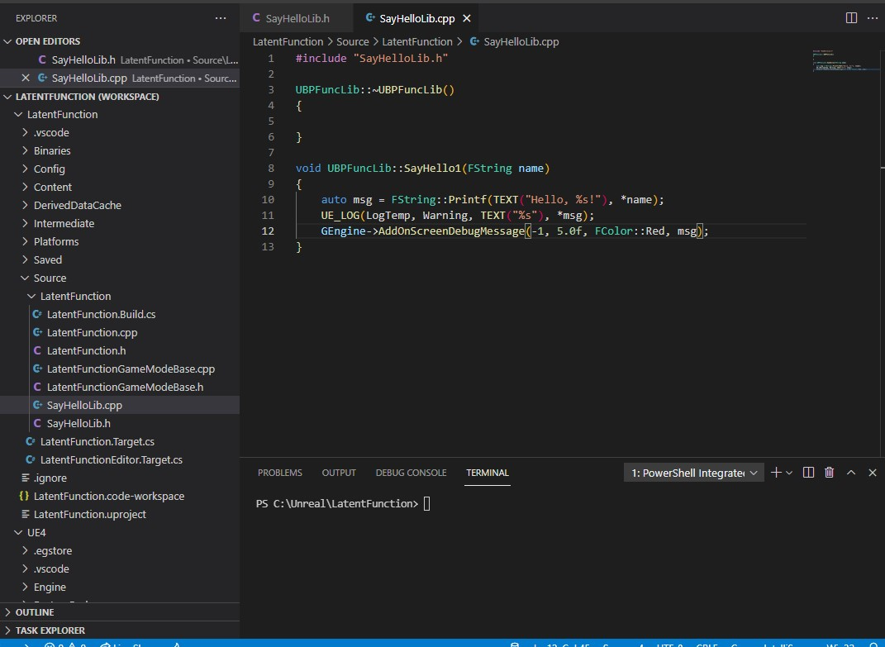

After compiling, we should be able to see and use our new node.

The nice thing is that the node's name came from our Function name. Realize how Unreal split the Pascal case from the function name into words.

We can also control de category. See how the "Hello Lib" category we see below is actually on the function metadata above. Also nice!


And if we hit Play.


# Create a function with multiple Exec pins

Now we will create something a little bit more complex. A node with multiple output execution pins.

The actual code is still relatively simple.

We first need to define an enum that will represent all pins. If you need dynamic pins, this approach will not work.

Second, you ask Unreal to create multiple pins with "ExpandEnumAsExecs". Its value is the parameter name.

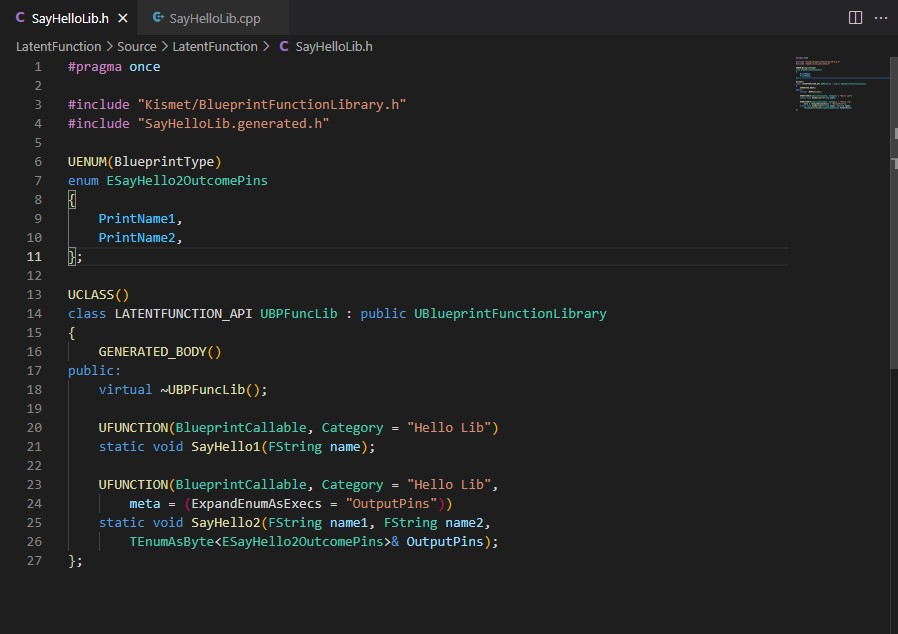

Inside the implementation, you just need to assign a value to this parameter, and Unreal will propagate the correct output pin. 


This is our new fancy node inside Blueprint.

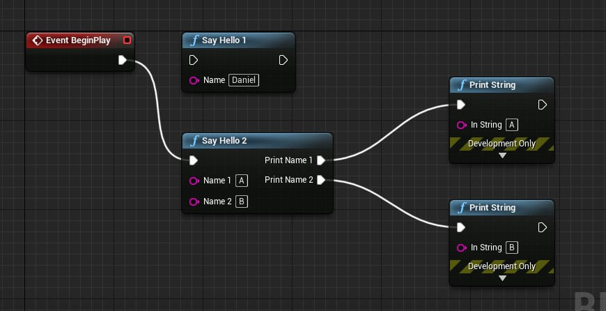

# Create a Latent Function

Now we can jump to more exciting nodes.

When we use "Delay", we realize that the output pin is not called immediately. It takes how long we asked. These kinds of nodes are called "Latent Functions" inside the engine.

They are a little bit more complex. But we can still create them very easily.

First, we need to define the function as being latent with a bunch of metadata.

HidePin and DefaultToSelf are not required but are excellent additions. If you are curious about what they do, just comment them.

Another essential part is the last parameter.


Inside the implementation is clear that this parameter contains all the need context information to schedule our latent function.

In our case, here, we will implement something similar to the Delay node.

All the first two "if"s do is checking if our latent function is already scheduled or not.

That is why you can call the delay function multiple times, but it triggers only once. Another option is, instead of ignoring subsequent executions, we can reset the trigger. That is what "Retriggable Delay" does.

Here, we just ignore them.

The core of this function is on the AddNewAction function—specifically the FDelayAction. 


This is a custom class we created that allow us to store some state and easily react to ticks and do whatever we want.

In this particular case, we are storing "TimeRemaining" and a bunch of metadata needed by the engine.

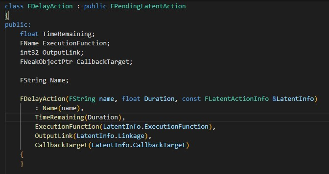

From time to time, the engine will call us at "UpdateOperation".

Here we just subtract RemainingTime, and if it hit zero or below, we complete the action. This is done by "FinishAndTriggerIf".


This is our brand new latent node in action. The clock on the top right flag the node as being latent.

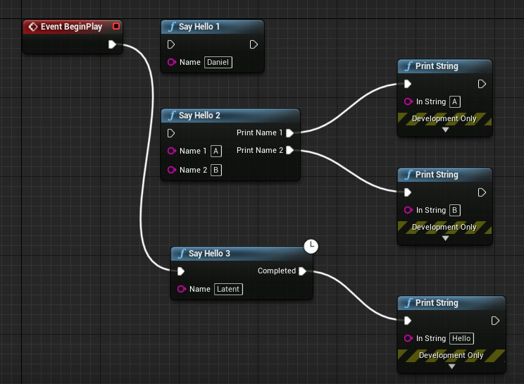

# Create Latent Function with Multiple Exec pins

If we want to go even further and we want our node to have multiple output pins. We can use another approach to create latent function.

In this example, we will create a simple countdown that signal when a "whole second" passed. It can allow us to do a countdown to a racing game, for example: 5...4...3...2...1...go!

We can implement a class that inherits from UBlueprintAsyncActionBase.

One of the important parts here is the DECLARE_DYNAMIC_MULTICAST_DELEGATE_OneParam. This mouthful macro creates a type that will define our output pin and its parameters. 

In this case, we will generate one integer named "Seconds".

Our output pins are defined inside the "private" section, and they are simple field using this type. In this case, we have "Updated" and "Completed".

Another vital thing to notice is the static function that will create the node.

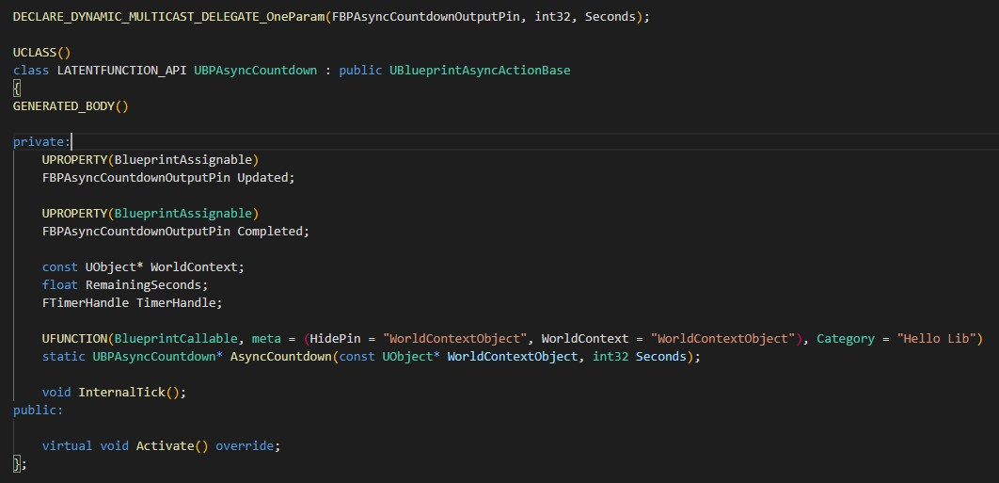

This function is quite simple. Create your class. Init all variables and return it.


Just after this function is called, the engine will call the "Activate" method of this class.

This is the place to start doing whatever this node does.

Here we will start a timer that will call us every 100ms.


Here we do our job.
We decrement the remaining time. And if a whole second has passed, we call the "Updated" pin. Passing how many seconds we still have.

If we reach zero, we call "Completed".

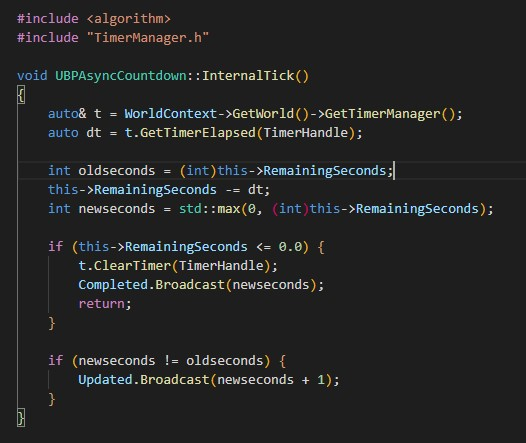

And we can use our adorable node in Blueprint now.

Imagine how hard and ugly would it be in pure Blueprint.

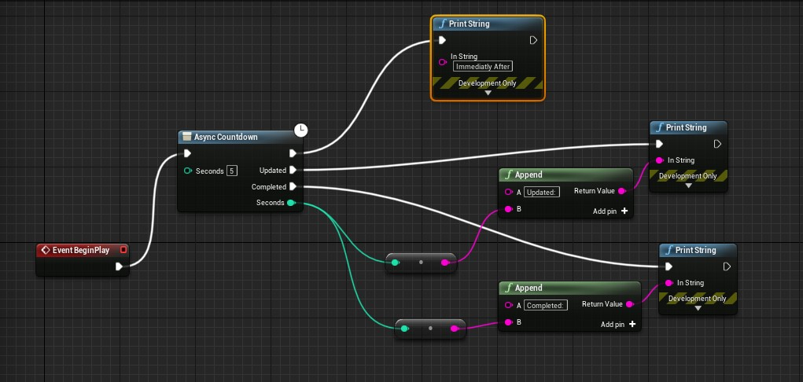

# Code

HelloLib.h

```
#pragma once

#include "Engine/EngineTypes.h"
#include "Kismet/BlueprintFunctionLibrary.h"
#include "Kismet/BlueprintAsyncActionBase.h"
#include "SayHelloLib.generated.h"

UENUM(BlueprintType)
enum ESayHello2OutcomePins
{
    PrintName1,
    PrintName2,
};

UCLASS()
class LATENTFUNCTION_API UBPFuncLib : public UBlueprintFunctionLibrary
{
    GENERATED_BODY()
public:
    virtual ~UBPFuncLib();

    UFUNCTION(BlueprintCallable, Category = "Hello Lib")
    static void SayHello1(FString name);

    UFUNCTION(BlueprintCallable, Category = "Hello Lib",
        meta = (ExpandEnumAsExecs = "OutputPins"))
    static void SayHello2(FString name1, FString name2,
        TEnumAsByte<ESayHello2OutcomePins>& OutputPins);

    UFUNCTION(BlueprintCallable, Category = "Hello Lib", 
        meta = (Latent, LatentInfo = "LatentInfo", HidePin = "WorldContextObject", DefaultToSelf = "WorldContextObject"))
    static void SayHello3(UObject *WorldContextObject, FString name, FLatentActionInfo LatentInfo);
};

DECLARE_DYNAMIC_MULTICAST_DELEGATE_OneParam(FBPAsyncCountdownOutputPin, int32, Seconds);

UCLASS()
class LATENTFUNCTION_API UBPAsyncCountdown : public UBlueprintAsyncActionBase
{
GENERATED_BODY()
    
private:
    UPROPERTY(BlueprintAssignable)
    FBPAsyncCountdownOutputPin Updated;
 
    UPROPERTY(BlueprintAssignable)
    FBPAsyncCountdownOutputPin Completed;

    const UObject* WorldContext;
    float RemainingSeconds;
    FTimerHandle TimerHandle;

    UFUNCTION(BlueprintCallable, meta = (HidePin = "WorldContextObject", WorldContext = "WorldContextObject"), Category = "Hello Lib")
    static UBPAsyncCountdown* AsyncCountdown(const UObject* WorldContextObject, int32 Seconds);

    void InternalTick();
public:

    virtual void Activate() override;
};
```

HelloLib.cpp
```
#include "SayHelloLib.h"

#include <algorithm>
#include "LatentActions.h"
#include "TimerManager.h"

UBPFuncLib::~UBPFuncLib()
{

}

void UBPFuncLib::SayHello1(FString name)
{
    auto msg = FString::Printf(TEXT("Hello, %s!"), *name);
    UE_LOG(LogTemp, Warning, TEXT("%s"), *msg);
    GEngine->AddOnScreenDebugMessage(-1, 5.0f, FColor::Red, msg);
}

void UBPFuncLib::SayHello2(FString name1, FString name2,
    TEnumAsByte<ESayHello2OutcomePins>& OutputPins)
{
    auto which = FMath::RandRange(0, 1);

    FString* name;
    if (which == 0) {
        name = &name1;
        OutputPins = ESayHello2OutcomePins::PrintName1;
    } else {
        name = &name2;
        OutputPins = ESayHello2OutcomePins::PrintName2;
    }

    if (name) 
    {
        auto msg = FString::Printf(TEXT("Hello, %s!"), **name);
        GEngine->AddOnScreenDebugMessage(-1, 5.0f, FColor::Red, msg);
    }
}

class FDelayAction : public FPendingLatentAction
{
public:
    float TimeRemaining;
    FName ExecutionFunction;
    int32 OutputLink;
    FWeakObjectPtr CallbackTarget;

    FString Name;

    FDelayAction(FString name, float Duration, const FLatentActionInfo &LatentInfo)
        : TimeRemaining(Duration), 
        ExecutionFunction(LatentInfo.ExecutionFunction), 
        OutputLink(LatentInfo.Linkage), 
        CallbackTarget(LatentInfo.CallbackTarget),
        Name(name)
    {
    }

    virtual void UpdateOperation(FLatentResponse &Response) override
    {
        TimeRemaining -= Response.ElapsedTime();

        if (TimeRemaining <= 0.0f) {
            auto msg = FString::Printf(TEXT("Hello, %s!"), *Name);
            GEngine->AddOnScreenDebugMessage(-1, 5.0f, FColor::Red, msg);
        }

        Response.FinishAndTriggerIf(TimeRemaining <= 0.0f, ExecutionFunction, OutputLink, CallbackTarget);
    }
};

void UBPFuncLib::SayHello3(UObject *WorldContextObject, FString name, FLatentActionInfo LatentInfo)
{
    GEngine->AddOnScreenDebugMessage(-1, 5.0f, FColor::Red, TEXT("Before"));

    if (UWorld *World = GEngine->GetWorldFromContextObjectChecked(WorldContextObject))
    {
        FLatentActionManager &LatentActionManager = World->GetLatentActionManager();
        if (LatentActionManager.FindExistingAction<FDelayAction>(LatentInfo.CallbackTarget, LatentInfo.UUID) == NULL)
        {
            LatentActionManager.AddNewAction(LatentInfo.CallbackTarget, LatentInfo.UUID, new FDelayAction(name, 1.0, LatentInfo));
        }
    }
}

UBPAsyncCountdown* UBPAsyncCountdown::AsyncCountdown(const UObject* WorldContextObj, int32 Seconds)
{
    UBPAsyncCountdown* Node = NewObject<UBPAsyncCountdown>();
    if (Node)
    {
        Node->WorldContext = WorldContextObj;
        Node->RemainingSeconds = (float)Seconds;
    }
    return Node;
}

void UBPAsyncCountdown::Activate()
{
    if (WorldContext)
    {
        FTimerDelegate TimerDelegate;
        TimerDelegate.BindUObject(this, &UBPAsyncCountdown::InternalTick);
        WorldContext->GetWorld()->GetTimerManager().SetTimer(TimerHandle, TimerDelegate, 0.1f, true);
    }
}


void UBPAsyncCountdown::InternalTick()
{
    auto& t = WorldContext->GetWorld()->GetTimerManager();
    auto dt = t.GetTimerElapsed(TimerHandle);

    int oldseconds = (int)this->RemainingSeconds;
    this->RemainingSeconds -= dt;
    int newseconds = std::max(0, (int)this->RemainingSeconds);

    if (this->RemainingSeconds <= 0.0) {
        t.ClearTimer(TimerHandle);
        Completed.Broadcast(newseconds);
        return;
    }
    
    if (newseconds != oldseconds) {
        Updated.Broadcast(newseconds + 1);
    }
}
```